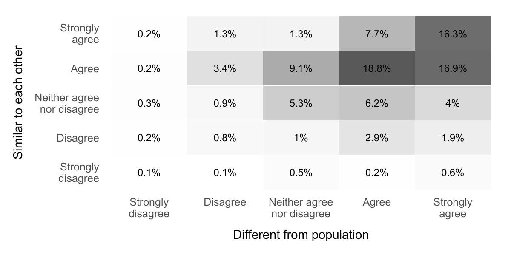
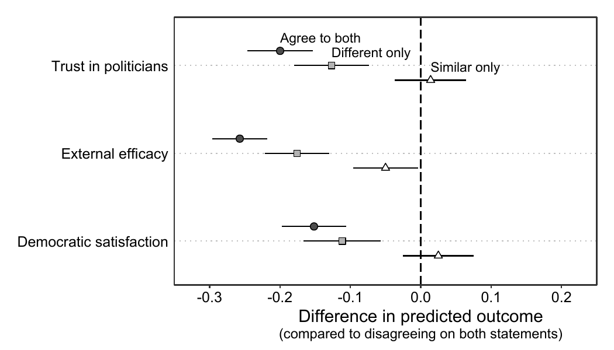
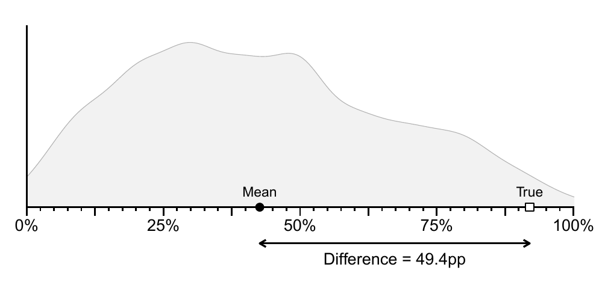
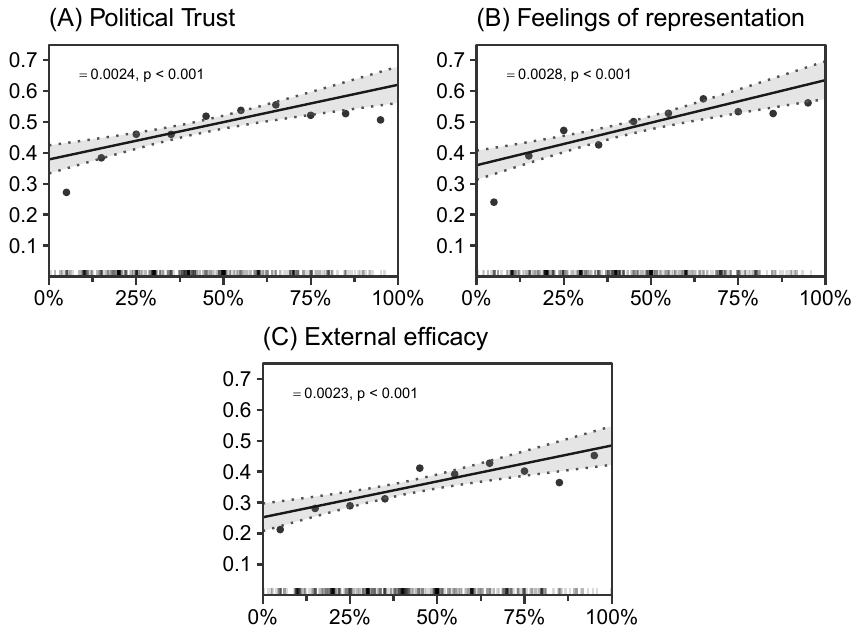
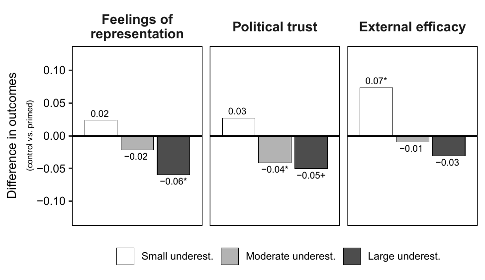

<!-- converting pdf-images from papers -->

```{r}
#| echo: false
#| include: false
#install.packages("pdftools")
library(pdftools)
#pdf_convert("research_outputs/pol_class_paper/paper1.pdf", format = "png", dpi = 150, filenames = "research_outputs/pol_class_paper/paper1b.png")
#pdf_convert("research_outputs/pol_class_paper/paper1a.pdf", format = "png", dpi = 150, filenames = "research_outputs/pol_class_paper/paper1a.png")

```
<!-- # Research -->

# Publications 
\newline

None :)

# Working Papers


::: wp-paper
[The Political Class in Citizens' Minds: Mapping Public Perceptions of Politicians]{.wp-paper-title} 


[Available upon request]{.wp-paper-available}

```{=html}
<details>
<summary>Abstract</summary>
<p class="wp-paper-abstract">Politicians are often portrayed as a socially distinct and internally homogeneous elite -- a narrative central to populist rhetoric and scholarly debates on political discontent. Yet we know little about how voters mentally represent politicians. Using survey data from Denmark (N=1,302), combining free association tasks, open-ended descriptions, and closed-ended items, I demonstrate that most citizens view politicians as both internally homogeneous and socially distinct from the general population. These perceptions correlate with negative characterisations and significantly lower political trust, external efficacy, and democratic satisfaction. Crucially, perceived social distinctiveness matters more than perceived homogeneity: citizens who view politicians as different from ordinary people show substantially diminished political support, regardless of whether they see politicians as similar to one another. By shifting analytical focus from objective elite characteristics to citizens’ mental representations, this study highlights the importance of not only who politicians <em>are</em>, but how they are <em>imagined</em> by the public.</p>
</details>
```

```{=html}
<div class="carousel">
  <button class="carousel-btn prev" onclick="moveSlide(this, -1)">&#8592;</button>
  <div class="carousel-track">
    
    
  </div>
  <button class="carousel-btn next" onclick="moveSlide(this, 1)">&#8594;</button>
</div>
```


<!-- ::: paper-links -->
<!-- [PDF](#) · [Pre-registration](#) -->
<!-- ::: -->
:::
 

```{r}
#| echo: false
#| include: false
#install.packages("pdftools")
library(pdftools)
pdf_convert("research_outputs/professionalisation_paper/plot1.pdf", format = "png", dpi = 150, filenames = "research_outputs/professionalisation_paper/plot1.png")

pdf_convert("research_outputs/professionalisation_paper/plot2.pdf", format = "png", dpi = 150, filenames = "research_outputs/professionalisation_paper/plot2.png")

pdf_convert("research_outputs/professionalisation_paper/plot3.pdf", format = "png", dpi = 150, filenames = "research_outputs/professionalisation_paper/plot3.png")

```

::: wp-paper
[Too Professional to Represent? Perceptions of Politicians’ Careers and Feelings of Representation]{.wp-paper-title}


```{=html}
<details>
<summary>Abstract</summary>
<p class="wp-paper-abstract">To come.</p>
</details>
```

```{=html}
<div class="carousel">
  <button class="carousel-btn prev" onclick="moveSlide(this, -1)">&#8592;</button>
  <div class="carousel-track">
    
    
    
  </div>
  <button class="carousel-btn next" onclick="moveSlide(this, 1)">&#8594;</button>
</div>
```

::: paper-links
[Pre-registration](research_outputs/professionalisation_paper/prereg.pdf)
:::

:::

## Work in Progress
::: ip-paper
[The Symbolic Consequences of Class Representation: Evidence from Britain and Denmark]{.ip-paper-title}

[(with Geoffrey Evans)]{.ip-paper-author}
:::

::: ip-paper
[Who They Are or What They Do? Descriptive and Symbstantive Class Representation and Political Support]{.ip-paper-title}
:::

::: ip-paper
[Class Attitudes and Political Trust]{.ip-paper-title}
:::


