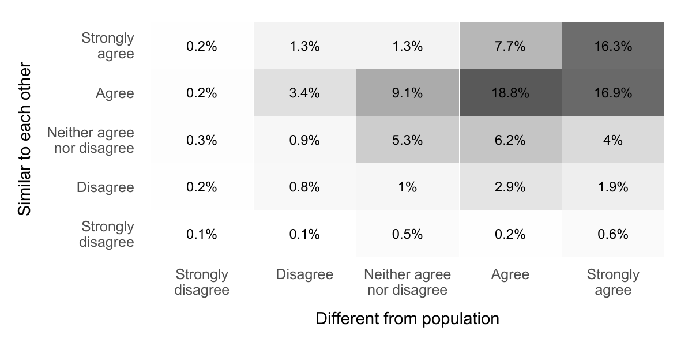
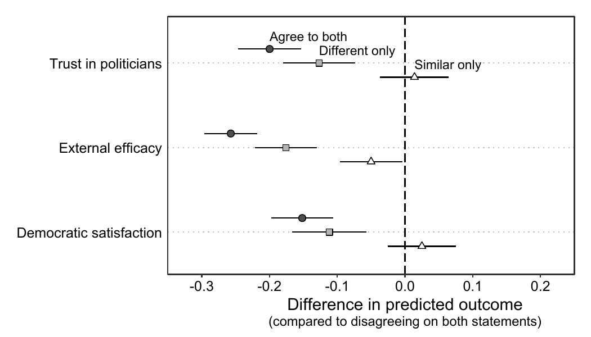
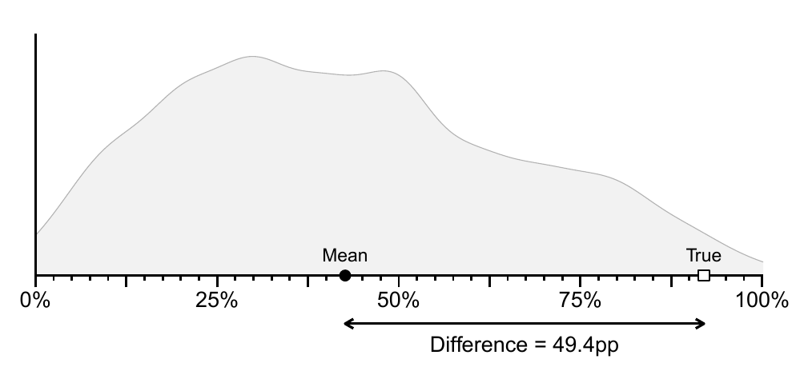
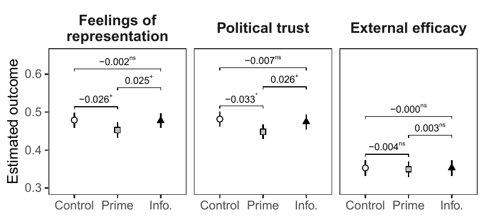
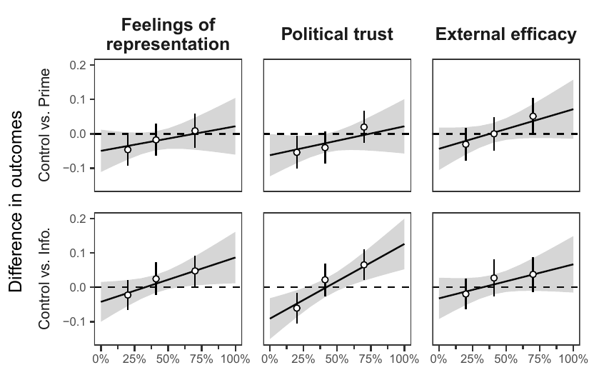
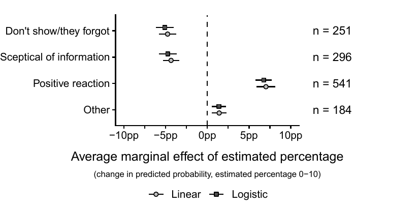
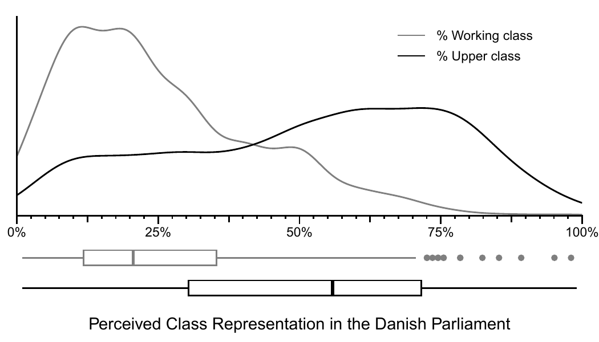
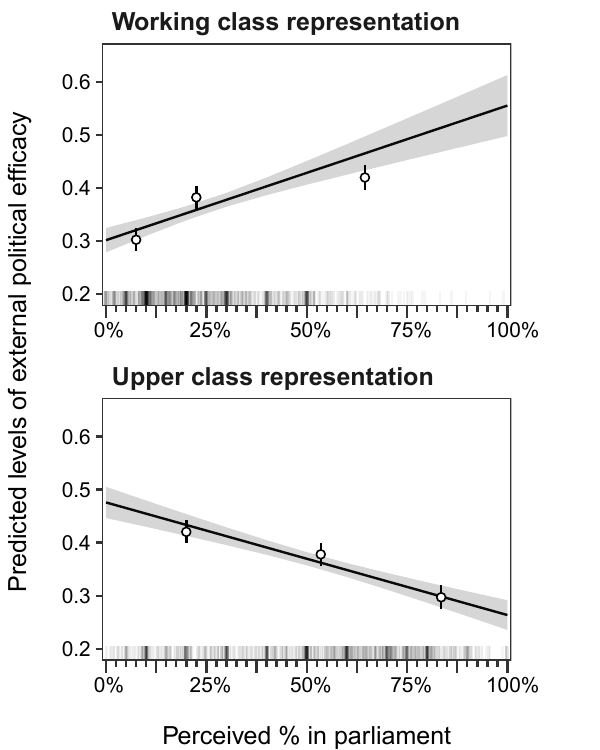
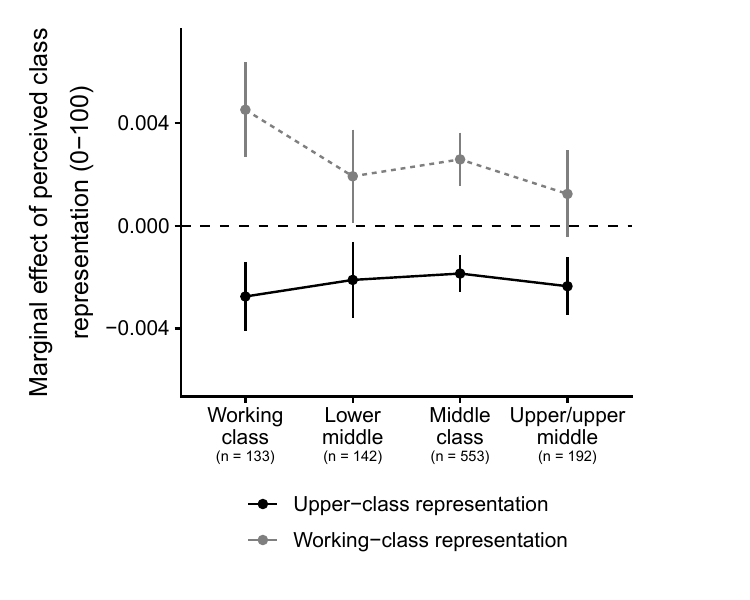

<!-- converting pdf-images from papers -->

```{r}
#| echo: false
#| include: false
#| eval: false   # <-- add this line

#install.packages("pdftools")
library(pdftools)
#pdf_convert("research_outputs/pol_class_paper/paper1.pdf", format = "png", dpi = 150, filenames = "research_outputs/pol_class_paper/paper1b.png")
#pdf_convert("research_outputs/pol_class_paper/paper1a.pdf", format = "png", dpi = 150, filenames = "research_outputs/pol_class_paper/paper1a.png")

```
<!-- # Research -->
 
## Publications 
\newline

None :)

## Working Papers


::: wp-paper
[The Political Class in Citizens' Minds: Mapping Public Perceptions of Politicians]{.wp-paper-title} 


[Available upon request]{.wp-paper-available}

```{=html}
<details>
<summary>Abstract</summary>
<p class="wp-paper-abstract">Politicians are often portrayed as a socially distinct and internally homogeneous elite -- a narrative central to populist rhetoric and scholarly debates on political discontent. Yet we know little about how voters mentally represent politicians. Using survey data from Denmark (N=1,302), combining free association tasks, open-ended descriptions, and closed-ended items, I demonstrate that most citizens view politicians as both internally homogeneous and socially distinct from the general population. These perceptions correlate with negative characterisations and significantly lower political trust, external efficacy, and democratic satisfaction. Crucially, perceived social distinctiveness matters more than perceived homogeneity: citizens who view politicians as different from ordinary people show substantially diminished political support, regardless of whether they see politicians as similar to one another. By shifting analytical focus from objective elite characteristics to citizens’ mental representations, this study highlights the importance of not only who politicians <em>are</em>, but how they are <em>imagined</em> by the public.</p>
</details>
```

```{=html}
<div class="carousel">
  <button class="carousel-btn prev" onclick="moveSlide(this, -1)">&#8592;</button>
  <div class="carousel-track">
    
    
  </div>
  <button class="carousel-btn next" onclick="moveSlide(this, 1)">&#8594;</button>
</div>
```


<!-- ::: paper-links -->
<!-- [PDF](#) · [Pre-registration](#) -->
<!-- ::: -->

:::
 

```{r}
#| echo: false
#| include: false
#install.packages("pdftools")
library(pdftools)
pdf_convert("research_outputs/professionalisation_paper/plot1.pdf", format = "png", dpi = 150, filenames = "research_outputs/professionalisation_paper/plot1.png")

pdf_convert("research_outputs/professionalisation_paper/plot2.pdf", format = "png", dpi = 150, filenames = "research_outputs/professionalisation_paper/plot2.png")

pdf_convert("research_outputs/professionalisation_paper/plot3.pdf", format = "png", dpi = 150, filenames = "research_outputs/professionalisation_paper/plot3.png")

pdf_convert("research_outputs/professionalisation_paper/plot4.pdf", format = "png", dpi = 150, filenames = "research_outputs/professionalisation_paper/plot4.png")

```

::: wp-paper
[Too Professional to Represent? Perceptions of Politicians’ Careers and Feelings of Representation]{.wp-paper-title}

[Available upon request]{.wp-paper-available}


```{=html}
<details>
<summary>Abstract</summary>
<p class="wp-paper-abstract"> A common concern in contemporary politics is that politicians are increasingly detached from the population. Central to this critique is the claim that politicians lack 'real-world' experience. Yet, little is known about citizens' perceptions of politicians' career background, or how these affect political support. Using an original survey from Denmark (N = 1.712), this paper documents a widespread conception of politicians as lacking extra-political experience. A pre-registered experiment further demonstrates that even subtle priming of these considerations reduces political support, whereas receiving new information does not produce a corresponding increase. Finally, analysis of open-ended responses shows that respondents who perceive MPs as lacking experience are more likely to question the information they receive, suggesting that perceptions of politicians -- and the consequences thereof -- may be rooted more in citizens’ feelings and culturally available narratives than in objective reality.</p>
</details>
```

```{=html}
<div class="carousel">
  <button class="carousel-btn prev" onclick="moveSlide(this, -1)">&#8592;</button>
  <div class="carousel-track">
    
    
    
    

  </div>
  <button class="carousel-btn next" onclick="moveSlide(this, 1)">&#8594;</button>
</div>
```

::: paper-links
[Pre-registration](research_outputs/professionalisation_paper/prereg.pdf)
:::
:::


<!-- ::: wp-paper  -->
<!-- [Perceptions of Descriptive Class Representation and Political Efficacy]{.wp-paper-title} -->

<!-- [Available upon request]{.wp-paper-available} -->


<!-- ```{=html} -->
<!-- <details> -->
<!-- <summary>Abstract</summary> -->
<!-- <p class="wp-paper-abstract">While the symbolic consequences of perceived descriptive representation have recently been studied with respect to gender and race, much less is known about class-based descriptive representation. Drawing on original survey data from Denmark, this letter makes three contributions. First, I show that perceived descriptive class representation is systematically associated with citizens' levels of external political efficacy. Second, I demonstrate an asymmetry: while perceived working-class inclusion is positively associated with efficacy, perceived upper-class overrepresentation is consistently associated with lower efficacy. Third, I show that while the benefits of perceived working-class inclusion are strongest among working-class identifiers, the associations hold across subjective class categories. These findings highlight citizens' perceptions of the class composition of legislatures as an understudied but consequential dimension of democratic support.</p> -->
<!-- </details> -->
<!-- ``` -->


<!-- ```{=html} -->
<!-- <div class="carousel"> -->
<!--   <button class="carousel-btn prev" onclick="moveSlide(this, -1)">&#8592;</button> -->
<!--   <div class="carousel-track"> -->
<!--      -->
<!--      -->
<!--      -->
<!--   </div> -->
<!--   <button class="carousel-btn next" onclick="moveSlide(this, 1)">&#8594;</button> -->
<!-- </div> -->
<!-- ``` -->

<!-- ::: -->

## Work in Progress
::: ip-paper
[Descriptive Class Representation and Symbolic Outcomes: Experimental Evidence from Denmark and the UK]{.ip-paper-title}

[(with Geoffrey Evans)]{.ip-paper-author}
:::

::: ip-paper
[Who They Are or What They Do? Descriptive and Symbstantive Class Representation and Political Support]{.ip-paper-title}
:::


